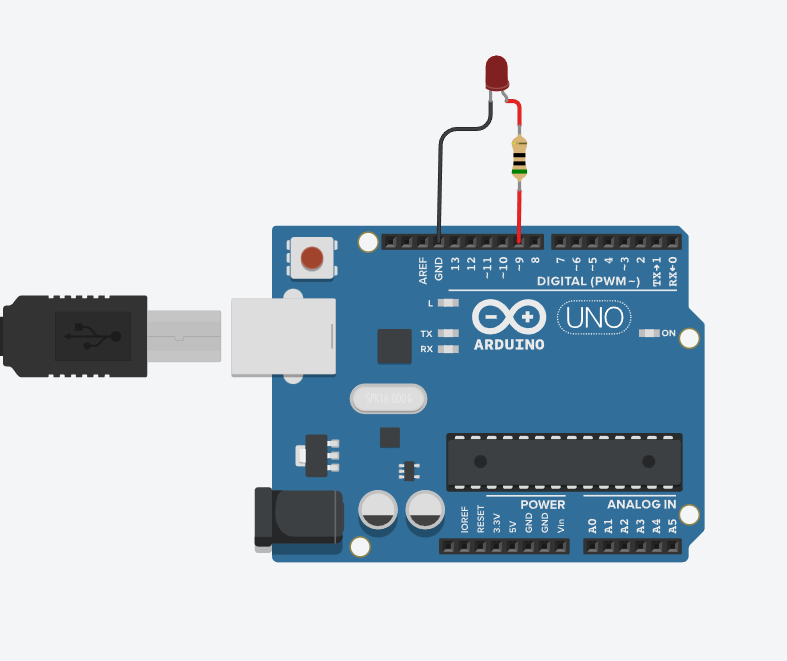

# Módulo 1 - Atividade 1: Acionamento de LED em Porta Digital

**Conteúdo:** Circuito básico com LED, resistor e porta digital.  
**Objetivo:** Desenvolver a compreensão sobre acionamento digital, polaridade do LED e fluxo de corrente em portas digitais do Arduino, utilizando simulação computacional no *Tinkercad*.

## Atividade Computacional -- Etapas
1. Acesse a plataforma *Tinkercad* e crie um novo circuito.
2. Transfira para o ambiente virtual o esquema de ligação da [Figura 1](../figuras/atividade1.png), que consiste em:
   - LED conectado à porta digital D9;
   - Resistor de 220 $\Omega$ em série;
   - Retorno do LED ao GND.
3. Após revisar as conexões, programe o Arduino conforme as questões A, B e C.



---

## Questão A -- Porta D9 em nível lógico LOW
Após montar o circuito no *Tinkercad*, programe a porta digital D9 em nível lógico LOW ($0\,V$).

### Código
O código correspondente está salvo no arquivo [m1_atividade1_questaoA.ino](../../codigos/modulo1/m1_atividade1_questaoA.ino).

```cpp
void setup() {
  pinMode(9, OUTPUT);
  digitalWrite(9, LOW);
}

void loop() {}
```

### Prever
Com a porta D9 configurada em LOW, o LED irá acender?
- [ ] Sim
- [ ] Não

### Observar e explicar
Após executar a simulação: Descreva o comportamento do LED e explique por que ele se comportou dessa forma, relacionando o nível lógico LOW e a polaridade do LED.

---

## Questão B -- Porta D9 em nível lógico HIGH
Agora, altere o código para configurar a porta D9 em nível lógico HIGH ($5\,V$).

### Código
O código correspondente está salvo no arquivo [m1_atividade1_questaoB.ino](../../codigos/modulo1/m1_atividade1_questaoB.ino).

```cpp
void setup() {
  pinMode (9, OUTPUT);
  digitalWrite(9, HIGH);
}

void loop() {}
```

### Prever
Com a porta D9 configurada em HIGH, o LED irá acender?
- [ ] Sim
- [ ] Não

### Observar e explicar
Após iniciar a simulação: Descreva o comportamento observado do LED e explique por que o nível HIGH altera seu funcionamento em comparação ao LOW.

---

## Questão C -- LED piscando com delay
Agora, modifique o programa para alternar o estado do LED a cada 1 segundo.

### Código
O código correspondente está salvo no arquivo [m1_atividade1_questaoC.ino](../../codigos/modulo1/m1_atividade1_questaoC.ino).


```cpp
void setup() {
  pinMode (9, OUTPUT);
}

void loop() {
  digitalWrite(9, HIGH);
  delay(1000);
  digitalWrite(9, LOW);
  delay(1000);
}
```

### Prever (marcar Sim/Não)
Com esse código, o LED irá piscar (acender e apagar repetidamente)?
- [ ] Sim
- [ ] Não

### Observar e explicar
Após executar a simulação: Descreva o comportamento do LED e explique como os comandos `digitalWrite()` e `delay()` controlam o ciclo de execução.
