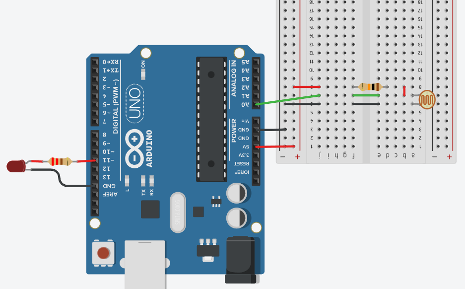

# Atividade 4: Sensores (LDR) e Leitura Analógica

## Descrição
* **Conteúdo:** Leitura analógica (`analogRead()`), divisor resistivo com LDR e análise de variação de tensão.
* **Objetivo:** Identificar como a resistência da LDR altera a leitura analógica e como essa leitura pode ser usada para acionar LEDs.

## Atividade Computacional — Etapas
1. Monte o circuito contendo:
   * LDR formando divisor resistivo com resistor de 10 $k\Omega$;
   * Saída do divisor conectada ao pino A0;
   * LED conectado ao pino digital D11 (PWM).
2. Após revisar a montagem, programe o Arduino conforme as questões A, B e C.



---

## Questão A — Leitura do Sensor

* **Código Fonte:** [m1_atividade4_questaoA.ino](../../codigos/modulo1/m1_atividade4_questaoA.ino)

```cpp
void setup() {
  Serial.begin(9600);
}

void loop() {
  int valor = analogRead(A0);
  Serial.println(valor);
  delay(300);
}
```

### Prever
Ao rodar o código inicial, o LED do pino 11 acenderá imediatamente?
- [ ] Sim
- [ ] Não

### Observar e explicar
Após executar a simulação, descreva como os valores exibidos no Monitor Serial variaram e explique por que esses valores mudam quando a luminosidade sobre a LDR aumenta ou diminui.

---

## Questão B — Controle de Brilho

* **Código Fonte:** [m1_atividade4_questaoB.ino](../../codigos/modulo1/m1_atividade4_questaoB.ino)

```cpp
void setup() {
  pinMode(11, OUTPUT);
}

void loop() {
  int val = analogRead(A0);
  analogWrite(11, val/4);
}
```

### Prever
Com este código, o brilho do LED em D11 irá variar proporcionalmente à luminosidade medida pela LDR?
- [ ] Sim
- [ ] Não

### Observar e explicar
Após executar a simulação, descreva como o brilho do LED mudou ao variar a luminosidade sobre a LDR. Explique a relação entre:
* O valor obtido com `analogRead()` (0 a 1023);
* O mapeamento para `analogWrite()` realizado pela divisão por 4 (0 a 255);
* O efeito final no PWM que controla o brilho do LED.

Comente também sobre limites perceptíveis, como valores mínimos que ainda produzem luminosidade visível.

---

## Questão C — LED como Alarme de Sombreamento

* **Código Fonte:** [m1_atividade4_questaoC.ino](../../codigos/modulo1/m1_atividade4_questaoC.ino)

```cpp
void setup() {
  pinMode(11, OUTPUT);
}

void loop() {
  int val = analogRead(A0);
  if (val < 400) digitalWrite(11, HIGH);
  else digitalWrite(11, LOW);
}
```

### Prever
Com este código, o LED em D11 acenderá quando a LDR estiver coberta (valor abaixo do limiar de 400)?
- [ ] Sim
- [ ] Não

### Observar e explicar
Após simular, descreva se o LED acendeu nas situações de pouca luz e explique por que um limiar é utilizado.

Comente sobre:
* Como escolher o valor do limiar (por exemplo, observando leituras do `analogRead()`);
* Possíveis efeitos de ruído e flutuação da leitura;
* Necessidade de filtragem ou técnicas de estabilização.
