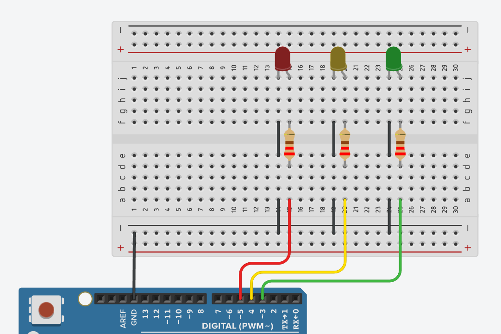

# Atividade 5: Projeto Final -- Semáforo com Temporização

## Descrição
* **Conteúdo:** Estruturas sequenciais, temporização e lógica de sistema.
* **Objetivo:** Programar um semáforo básico utilizando três LEDs e controle de tempo, integrando os conceitos desenvolvidos nos guias anteriores.

## Atividade Computacional — Etapas
1. Monte o circuito contendo:
   * LED verde conectado ao pino D3;
   * LED amarelo conectado ao pino D4;
   * LED vermelho conectado ao pino D5.
2. Após revisar todas as conexões, programe conforme as questões A, B e C.



---

## Questão A — Sequência Padrão

* **Código Fonte:** [m1_atividade5_questaoA.ino](../../codigos/m1_atividade5_questaoA.ino)

```cpp
void setup() {
  pinMode(3, OUTPUT);
  pinMode(4, OUTPUT);
  pinMode(5, OUTPUT);
}

void loop() {
  digitalWrite(3, HIGH); delay(4000);
  digitalWrite(3, LOW);

  digitalWrite(4, HIGH); delay(1500);
  digitalWrite(4, LOW);

  digitalWrite(5, HIGH); delay(4000);
  digitalWrite(5, LOW);
}
```

### Prever
Com esse código, os LEDs irão acender na ordem: verde $\rightarrow$ amarelo $\rightarrow$ vermelho?
- [ ] Sim
- [ ] Não

### Observar e explicar
Após executar a simulação, descreva a função de cada LED no ciclo do semáforo e explique como a temporização dada por `delay()` determina tanto a ordem quanto a duração de cada fase (verde, amarelo e vermelho).

---

## Questão B — Alteração dos Tempos

### Instrução
Modifique os tempos de cada fase (por exemplo, reduzir o tempo do verde ou aumentar o do vermelho) e observe o comportamento resultante.

### Prever
Ao alterar os tempos dos `delay()`, o ritmo do semáforo irá mudar?
- [ ] Sim
- [ ] Não

### Observar e explicar
Após executar a simulação com novos tempos: Descreva como a alteração dos tempos modificou o fluxo visual do semáforo. Explique também como o tempo de cada LED influencia a percepção e o entendimento do ciclo completo pelo usuário.

---

## Questão C — Falha Simulada (LED Amarelo Apagado)

* **Código Fonte:** [m1_atividade5_questaoC.ino](../../codigos/m1_atividade5_questaoC.ino)

```cpp
void setup() {
  pinMode(3, OUTPUT);
  pinMode(4, OUTPUT); // amarelo (não acende)
  pinMode(5, OUTPUT);
}

void loop() {
  digitalWrite(3, HIGH); delay(4000);
  digitalWrite(3, LOW);

  // LED amarelo omitido propositalmente (falha)
  delay(1500);

  digitalWrite(5, HIGH); delay(4000);
  digitalWrite(5, LOW);
}
```

### Prever
Com o LED amarelo desligado, o ciclo do semáforo ficará incompleto?
- [ ] Sim
- [ ] Não

### Observar e explicar
Após simular, descreva o comportamento do semáforo sem o LED amarelo e explique como a ausência dessa etapa afeta a segurança e o entendimento do ciclo (e.g., transição direta de verde $\rightarrow$ vermelho).
