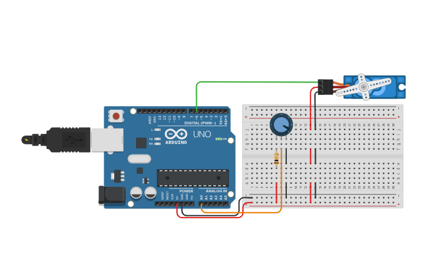

# Atividade 10: Servomotor Controlado por Potenciômetro

## Descrição
* **Conteúdo:** Controle de servo, ângulo de rotação e sinal PWM especial.
* **Objetivo:** Programar um servomotor para mover-se proporcionalmente ao valor lido no potenciômetro.

## Atividade Computacional — Etapas
1. Monte o circuito conforme a imagem descrita:
   * Servomotor ligado ao pino D6.
   * Potenciômetro ligado ao pino A0.
2. Programe conforme as questões A, B e C.



---

## Questão A — Movimento básico

* **Código Fonte:** [m2_atividade10_questaoA.ino](../../codigos/modulo2/m2_atividade10_questaoA.ino)

```cpp
#include <Servo.h>

Servo s;

void setup() {
  s.attach(6);
}

void loop() {
  int val = analogRead(A0);
  int angulo = map(val, 0, 1023, 0, 180);
  s.write(angulo);
}
```

### Prever
A posição do potenciômetro interfere na posição do servomotor?
- [ ] Sim
- [ ] Não

### Observar e Explicar
Após executar a simulação, observe e explique como a posição do potenciômetro afeta a posição do servomotor.

---

## Questão B — Movimento invertido

* **Código Fonte:** [m2_atividade10_questaoB.ino](../../codigos/modulo2/m2_atividade10_questaoB.ino)

```cpp
#include <Servo.h>

Servo s;

void setup() {
  s.attach(6);
}

void loop() {
  int val = analogRead(A0);
  int angulo = map(val, 0, 1023, 180, 0);
  s.write(angulo);
}
```

### Prever
Ao alterar o mapeamento, o comportamento do servomotor em relação à posição do potenciômetro muda?
- [ ] Sim
- [ ] Não

### Observar e Explicar
Após executar a simulação, observe e explique como o mapeamento afeta o comportamento do servomotor.

---

## Questão C — Movimentação limitada

* **Código Fonte:** [m2_atividade10_questaoC.ino](../../codigos/modulo2/m2_atividade10_questaoC.ino)

```cpp
#include <Servo.h>

Servo s;

void setup() {
  s.attach(6);
}

void loop() {
  int val = analogRead(A0);
  int angulo = map(val, 0, 1023, 30, 150);
  s.write(angulo);
}
```

### Prever
Ao reduzir os valores de ângulo máximo no mapeamento, a movimentação do servomotor também é reduzida?
- [ ] Sim
- [ ] Não

### Observar e Explicar
Após executar a simulação, observe e explique a movimentação atual do servomotor com os novos valores de ângulo máximo no mapeamento. Determine a angulação mínima e máxima do servomotor.
