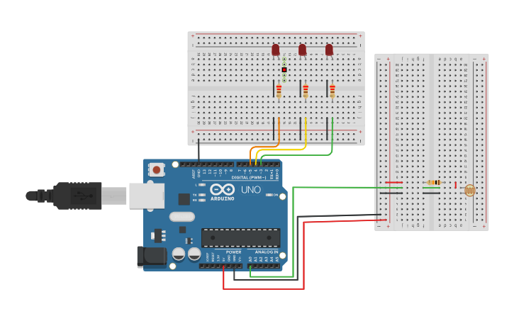

# Atividade 6: Sensor de Luminosidade (LDR)

## Descrição
* **Conteúdo:** Leitura analógica, divisor resistivo, variação de tensão e comportamento do LDR.
* **Objetivo:** Compreender como variações de luminosidade influenciam a leitura analógica no Arduino e como essa leitura pode ser interpretada para controle de LEDs.

## Atividade Computacional — Etapas
1. Abra o Tinkercad e crie um novo circuito.
2. Reproduza o esquema de ligação da imagem abaixo:
   * LED vermelho ligado ao pino D2; LED amarelo ligado ao pino D3; LED verde ligado ao pino D4 (cada um com resistor de 220 $\Omega$ em série).
   * LDR conectado a 5 V (fio vermelho).
   * Resistor de 10 $k\Omega$ ligado entre o nó do LDR e o GND (fio preto).
   * Ponto intermediário do divisor conectado ao pino A0 (fio verde).
3. Após revisar todas as ligações, programe o Arduino conforme as questões A, B e C.



---

## Questão A — Indicação do nível de luz

* **Código Fonte:** [m2_atividade6_questaoA.ino](../../codigos/modulo2/m2_atividade6_questaoA.ino)

```cpp
int ldrPin = A0;
int led1 = 3;   
int led2 = 4;   
int led3 = 5;

void setup() {
  pinMode(led1, OUTPUT);
  pinMode(led2, OUTPUT);
  pinMode(led3, OUTPUT);
  Serial.begin(9600);
}

void loop() {
  int luz = analogRead(ldrPin);
  Serial.println(luz);

  if (luz < 100) {
    digitalWrite(led1, HIGH);
    digitalWrite(led2, LOW);
    digitalWrite(led3, LOW);
  }
  else if (luz < 450) {
    digitalWrite(led1, HIGH);
    digitalWrite(led2, HIGH);
    digitalWrite(led3, LOW);
  }
  else {
    digitalWrite(led1, HIGH);
    digitalWrite(led2, HIGH);
    digitalWrite(led3, HIGH);
  }

  delay(100);
}
```

### Prever
Os LEDs indicam de alguma forma o valor da resistência do sensor LDR?
- [ ] Sim
- [ ] Não

### Observar e explicar
Após executar a simulação, observe o comportamento dos LEDs em relação ao valor da resistência do sensor LDR e explique qual é a relação entre a luminosidade e a quantidade de LEDs acesos.

---

## Questão B — Criando uma nova escala

* **Código Fonte:** [m2_atividade6_questaoB.ino](../../codigos/modulo2/m2_atividade6_questaoB.ino)

```cpp
int ldrPin = A0;
int led1 = 3;
int led2 = 4;
int led3 = 5;

void setup() {
  pinMode(led1, OUTPUT);
  pinMode(led2, OUTPUT);
  pinMode(led3, OUTPUT);
  Serial.begin(9600);
}

void loop() {
  int luz = analogRead(ldrPin);
  Serial.println(luz);

  if (luz < 50) {
    digitalWrite(led1, LOW);
    digitalWrite(led2, LOW);
    digitalWrite(led3, LOW);
  }
  else if (luz >= 50 && luz < 300) {
    digitalWrite(led1, HIGH);
    digitalWrite(led2, LOW);
    digitalWrite(led3, LOW);
  }
  else if (luz >= 300 && luz < 600) {
    digitalWrite(led1, HIGH);
    digitalWrite(led2, HIGH);
    digitalWrite(led3, LOW);
  }
  else {
    digitalWrite(led1, HIGH);
    digitalWrite(led2, HIGH);
    digitalWrite(led3, HIGH);
  }

  delay(100);
}
```

### Prever
Ao alterar a quantidade de condicionais no código, usando outro intervalo como parâmetro, é possível gerar outro comportamento?
- [ ] Sim
- [ ] Não

### Observar e explicar
Após executar a simulação, explique como o número de condicionais e os diferentes intervalos usados como parâmetro afetam o comportamento dos LEDs.

---

## Questão C — Escala inversa

* **Código Fonte:** [m2_atividade6_questaoC.ino](../../codigos/modulo2/m2_atividade6_questaoC.ino)

```cpp
int ldrPin = A0;
int led1 = 3;
int led2 = 4;
int led3 = 5;

void setup() {
  pinMode(led1, OUTPUT);
  pinMode(led2, OUTPUT);
  pinMode(led3, OUTPUT);
  Serial.begin(9600);
}

void loop() {
  int luz = analogRead(ldrPin);
  Serial.println(luz);

  if (luz >= 700) {
    digitalWrite(led1, LOW);
    digitalWrite(led2, LOW);
    digitalWrite(led3, LOW);
  }
  else if (luz >= 450 && luz < 700) {
    digitalWrite(led1, HIGH);
    digitalWrite(led2, LOW);
    digitalWrite(led3, LOW);
  }
  else if (luz >= 100 && luz < 450) {
    digitalWrite(led1, HIGH);
    digitalWrite(led2, HIGH);
    digitalWrite(led3, LOW);
  }
  else {
    digitalWrite(led1, HIGH);
    digitalWrite(led2, HIGH);
    digitalWrite(led3, HIGH);
  }

  delay(100);
}
```

### Prever
Ao inverter os parâmetros das condicionais, o comportamento dos LEDs também é invertido?
- [ ] Sim
- [ ] Não

### Observar e explicar
Após executar a simulação, observe e explique como os LEDs se comportam agora com os parâmetros invertidos.
