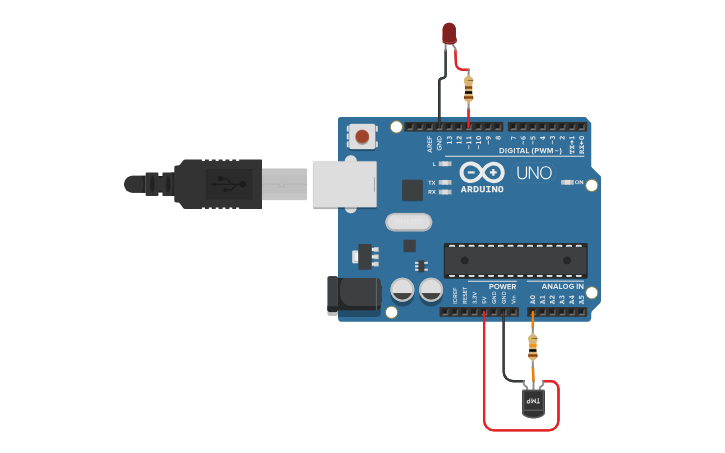

# Atividade 7: Sensor de Temperatura (Termistor NTC)

## Descrição
* **Conteúdo:** Resistência variável, divisor resistivo, leitura analógica e comportamento térmico.
* **Objetivo:** Compreender como a resistência de um termistor NTC varia com a temperatura e como essa variação afeta a leitura analógica do Arduino.

## Atividade Computacional — Etapas
1. Abra o Tinkercad e monte o circuito conforme a imagem descrita:
   * Termistor NTC e resistor de 10 $k\Omega$ formando um divisor resistivo conectado ao pino A0.
   * LED conectado ao pino D11 (PWM), com resistor de 220 $\Omega$ em série.
2. Após revisar as conexões, programe conforme as questões A, B e C.



---

## Questão A — Leitura do Termistor

* **Código Fonte:** [m2_atividade7_questaoA.ino](../../codigos/modulo2/m2_atividade7_questaoA.ino)

```cpp
void setup() {
  Serial.begin(9600);
}

void loop() {
  int leitura = analogRead(A0);
  Serial.println(leitura);
  delay(300);
}
```

### Prever
A leitura analógica do NTC cresce junto com a temperatura?
- [ ] Sim
- [ ] Não

### Observar e explicar
Após executar a simulação, observe e explique como se comporta o valor no monitor serial em relação à temperatura. Fale também sobre o intervalo registrado pelo sensor e o intervalo impresso no monitor serial.

---

## Questão B — LED como Indicador de Temperatura

* **Código Fonte:** [m2_atividade7_questaoB.ino](../../codigos/modulo2/m2_atividade7_questaoB.ino)


```cpp
void setup() {
  pinMode(11, OUTPUT);
}

void loop() {
  int leitura = analogRead(A0);
  if (leitura > 300)
    digitalWrite(11, HIGH);
  else
    digitalWrite(11, LOW);
}
```

### Prever
O estado do LED (ligado ou desligado) é controlled com base na temperatura registrada pelo sensor?
- [ ] Sim
- [ ] Não

### Observar e explicar
Após executar a simulação, observe e explique como funciona a relação entre a temperatura registrada pelo sensor e o estado do LED. Além disso, determine o intervalo usado como parâmetro na condicional.

---

## Questão C — Intensidade Proporcional

* **Código Fonte:** [m2_atividade7_questaoC.ino](../../codigos/modulo2/m2_atividade7_questaoC.ino)

```cpp
void setup() {
  pinMode(11, OUTPUT);
}

void loop() {
  int leitura = analogRead(A0);
  analogWrite(11, leitura * 1.4);
}
```

### Prever
Ao ligar um LED na saída D11 do Arduino, o brilho será controlado com base na temperatura do sensor NTC?
- [ ] Sim
- [ ] Não

### Observar e explicar
Após executar a simulação, observe e explique como a temperatura registrada pelo sensor interfere no brilho do LED.
