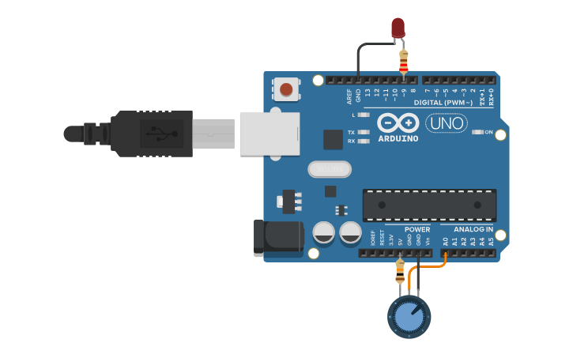

# Atividade 8: Potenciômetro e Controle Analógico

## Descrição
* **Conteúdo:** Entrada analógica, mapeamento de valores e relação entre A0 e sinais PWM.
* **Objetivo:** Compreender como um potenciômetro pode controlar intensidade ou velocidade via leitura analógica.

## Atividade Computacional — Etapas
1. Monte o circuito conforme a imagem descrita:
   * Potenciômetro de 10 $k\Omega$ com saída central ligada ao pino A0.
   * LED conectado ao pino D9, com resistor de 220 $\Omega$ em série.
2. Após revisar todas as conexões, programe conforme as questões A, B e C.



---

## Questão A — Leitura do Potenciômetro

* **Código Fonte:** [m2_atividade8_questaoA.ino](../../codigos/modulo2/m2_atividade8_questaoA.ino)


```cpp
void setup() {			
  Serial.begin(9600);
}

void loop() {
  int valor = analogRead(A0);
  Serial.println(valor);
  delay(200);
}
```

### Prever
O monitor serial exibe o valor coletado pelo Arduino referente à posição do potenciômetro?
- [ ] Sim
- [ ] Não

### Observar e explicar
Após executar a simulação, observe e explique como o potenciômetro interfere no valor exibido no monitor serial. Determine o intervalo capturado.

---

## Questão B — Controle de Brilho

* **Código Fonte:** [m2_atividade8_questaoB.ino](../../codigos/modulo2/m2_atividade8_questaoB.ino)

```cpp
void setup() {
  pinMode(9, OUTPUT);
}

void loop() {
  int val = analogRead(A0);
  analogWrite(9, val / 4);
}
```

### Prever
A posição do potenciômetro interfere no brilho do LED?
- [ ] Sim
- [ ] Não

### Observar e explicar
Após executar a simulação, observe e explique como funciona a relação entre o brilho do LED e a posição do potenciômetro. Determine também se a relação é diretamente ou inversamente proporcional.

---

## Questão C — Controle Invertido

* **Código Fonte:** [m2_atividade8_questaoC.ino](../../codigos/modulo2/m2_atividade8_questaoC.ino)

```cpp
void setup() {
  pinMode(9, OUTPUT);
}

void loop() {
  int val = analogRead(A0);
  analogWrite(9, 255 - (val / 4));
}
```

### Prever
Ao alterar o parâmetro no comando de ativação, o comportamento do LED muda?
- [ ] Sim
- [ ] Não

### Observar e explicar
Após executar a simulação, observe e explique o novo comportamento. Determine também se a relação é diretamente ou inversamente proporcional.
