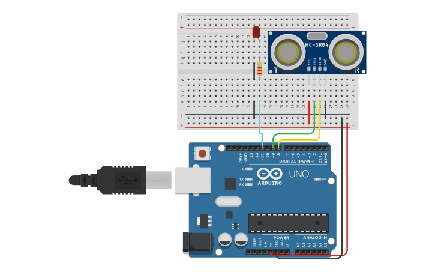

# Atividade 9: Sensor Ultrassônico HC-SR04

## Descrição
* **Conteúdo:** Geração de pulso, cálculo de distância e leitura digital temporizada.
* **Objetivo:** Medir distâncias no Tinkercad e interpretar como sensores são utilizados em aplicações de robótica.

## Atividade Computacional — Etapas
1. Monte o circuito conforme a imagem descrita:
   * Sensor ultrassônico HC-SR04 conectado com Trigger em D9 e Echo em D8.
   * LED na porta D11, com resistor de 220 $\Omega$ em série.
2. Programe conforme as questões A, B e C.



---

## Questão A — Medição simples

* **Código Fonte:** [m2_atividade9_questaoA.ino](../../codigos/modulo2/m2_atividade9_questaoA.ino)

```cpp
long medirDistancia() {
  digitalWrite(9, LOW); delayMicroseconds(2);
  digitalWrite(9, HIGH); delayMicroseconds(10);
  digitalWrite(9, LOW);
  long duracao = pulseIn(8, HIGH);
  return duracao / 58.0;
}

void setup() {
  Serial.begin(9600);
  pinMode(9, OUTPUT);
  pinMode(8, INPUT);
}

void loop() {
  Serial.println(medirDistancia());
  delay(300);
}
```

### Prever
O código informa a distância em centímetros no monitor serial?
- [ ] Sim
- [ ] Não

### Observar e Explicar
Após executar a simulação, observe e explique como funciona o processo principal do código.

---

## Questão B — LED de alerta

* **Código Fonte:** [m2_atividade9_questaoB.ino](../../codigos/modulo2/m2_atividade9_questaoB.ino)

```cpp
long medirDistancia() {
  digitalWrite(9, LOW); delayMicroseconds(2);
  digitalWrite(9, HIGH); delayMicroseconds(10);
  digitalWrite(9, LOW);
  long duracao = pulseIn(8, HIGH);
  return duracao / 58.0;
}

void setup() {
  pinMode(11, OUTPUT);
  pinMode(9, OUTPUT);
  pinMode(8, INPUT);
}

void loop() {
  long d = medirDistancia();
  if (d < 90) digitalWrite(11, HIGH);
  else digitalWrite(11, LOW);
}
```

### Prever
O estado do LED (ligado ou desligado) depende da distância?
- [ ] Sim
- [ ] Não

### Observar e Explicar
Após executar a simulação, observe e explique como a distância se relaciona com o estado do LED. Determine o parâmetro usado na condicional.

---

## Questão C — Intensidade proporcional à distância

* **Código Fonte:** [m2_atividade9_questaoC.ino](../../codigos/modulo2/m2_atividade9_questaoC.ino)

```cpp
long medirDistancia() {
  digitalWrite(9, LOW); delayMicroseconds(2);
  digitalWrite(9, HIGH); delayMicroseconds(10);
  digitalWrite(9, LOW);
  long duracao = pulseIn(8, HIGH);
  return duracao / 58.0;
}

void setup() {
  pinMode(11, OUTPUT);
  pinMode(9, OUTPUT);
  pinMode(8, INPUT);
}

void loop() {
  long d = medirDistancia();
  int pwm = map(d, 0, 335, 255, 0);
  analogWrite(11, pwm);
}
```

### Prever
A distância interfere no brilho do LED?
- [ ] Sim
- [ ] Não

### Observar e Explicar
Após executar a simulação, observe e explique como a distância afeta o brilho do LED. Determine o intervalo mínimo e máximo.
