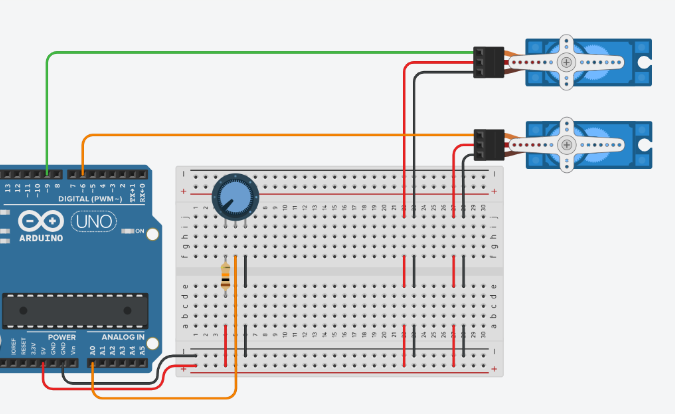

# Atividade 11: Controle de Mini Braço Robótico (2 Servos)

## Descrição
* **Conteúdo:** Controle coordenado de servomotores e conversão analógica para ângulo.
* **Objetivo:** Controlar dois servomotores simultaneamente para simular o movimento de um braço robótico básico, utilizando leitura analógica e mapeamento de valores no ambiente virtual Tinkercad.

## Atividade Computacional — Etapas
1. Acesse a plataforma Tinkercad e crie um novo circuito.
2. Reproduza o esquema de ligação da imagem descrita:
   * Servomotor 1 conectado ao pino digital D6.
   * Servomotor 2 conectado ao pino digital D9.
   * Potenciômetro conectado ao pino analógico A0.
3. Após revisar as conexões, programe o Arduino conforme as questões A, B e C.



---

## Questão A — Movimento proporcional

* **Código Fonte:** [m3_atividade11_questaoA.ino](../../codigos/modulo3/m3_atividade11_questaoA.ino)

```cpp
#include <Servo.h>

Servo s1, s2;

void setup() {
  s1.attach(6);
  s2.attach(9);
}

void loop() {
  int v = analogRead(A0);
  int ang = map(v, 0, 1023, 0, 180);

  s1.write(ang);
  s2.write(180 - ang);
}
```

### Prever
Os servomotores têm a mesma amplitude de movimentação?
- [ ] Sim
- [ ] Não

### Observar e explicar
Após executar a simulação, observe o comportamento dos servomotores em relação à posição do potenciômetro e explique como ocorre o movimento proporcional entre eles.

---

## Questão B — Movimentos independentes

Altere o comportamento dos servomotores utilizando os novos parâmetros de escala.

* **Código Fonte:** [m3_atividade11_questaoB.ino](../../codigos/modulo3/m3_atividade11_questaoB.ino)

```cpp
#include <Servo.h>

Servo s1, s2;

void setup() {
  s1.attach(6);
  s2.attach(9);
}

void loop() {
  int v = analogRead(A0);
  s1.write(map(v, 0, 1023, 30, 150));
  s2.write(map(v, 0, 1023, 60, 120));
}
```

### Prever
Ao alterar os parâmetros da função `map()`, os servomotores permanecerão com a mesma amplitude de movimentação?
- [ ] Sim
- [ ] Não

### Observar e explicar
Após executar a simulação, explique como a alteração na função `map()` modificou o comportamento e a amplitude de movimentação dos servomotores.

---

## Questão C — Movimento em etapas

Agora, modifique o código para que o servomotor atue em posições fixas utilizando estruturas condicionais.

* **Código Fonte:** [m3_atividade11_questaoC.ino](../../codigos/modulo3/m3_atividade11_questaoC.ino)

```cpp
#include <Servo.h>

Servo s1, s2;

void setup() {
  s1.attach(6);
  s2.attach(9);
}

void loop() {
  int v = analogRead(A0);
  if (v < 300) {
    s1.write(0);
  }
  else if (v < 600) {
    s1.write(90);
  }
  else {
    s1.write(180);
  }
}
```

### Prever
Com o uso das condicionais, os servomotores atuarão em etapas ao invés de forma contínua?
- [ ] Sim
- [ ] Não

### Observar e explicar
Após executar a simulação, explique como funciona a divisão das etapas de atuação dos servomotores e como as estruturas condicionais alteram o comportamento do movimento.
