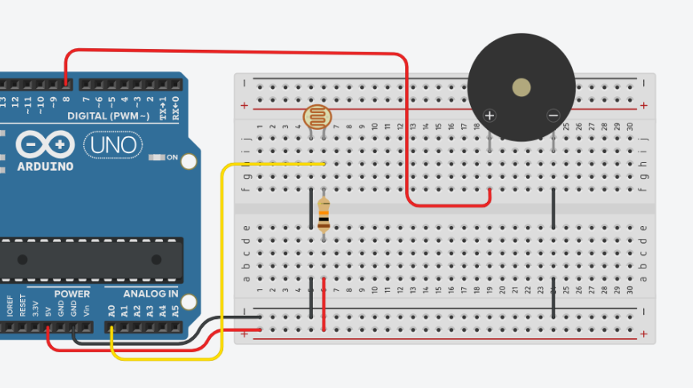

# Atividade 12: Alarme com LDR e Buzzer

## Descrição
* **Conteúdo:** Sensor de luminosidade, comparação de limiar e atuador sonoro.
* **Objetivo:** Criar um alarme simples que ativa um buzzer quando o ambiente está escuro, utilizando leitura analógica e lógica condicional no ambiente virtual Tinkercad.

## Atividade Computacional — Etapas
1. Acesse a plataforma Tinkercad e crie um novo circuito.
2. Reproduza o esquema de ligação da imagem descrita:
   * LDR e resistor de 10 $k\Omega$ formando um divisor resistivo ligado ao pino analógico A0.
   * Buzzer ativo conectado ao pino digital D8.
3. Após revisar as conexões, programe o Arduino conforme as questões A, B e C.



---

## Questão A — Leitura do sensor

* **Código Fonte:** [m3_atividade12_questaoA.ino](../../codigos/modulo3/m3_atividade12_questaoA.ino)

```cpp
void setup() {
  Serial.begin(9600);
}

void loop() {
  int v = analogRead(A0);
  Serial.println(v);
  delay(300);
}
```

### Prever
Com esse código implementado, o sensor LDR tem alguma atuação além de imprimir o valor capturado no monitor serial?
- [ ] Sim
- [ ] Não

### Observar e explicar
Após executar a simulação, observe e explique como se comporta o valor apresentado no monitor serial em relação à luminosidade. Comente também sobre o intervalo registrado pelo sensor e o intervalo impresso no monitor serial.

---

## Questão B — Alarme por limiar

* **Código Fonte:** [m3_atividade12_questaoB.ino](../../codigos/modulo3/m3_atividade12_questaoB.ino)

```cpp
void setup() {
  pinMode(8, OUTPUT);
}

void loop() {
  int v = analogRead(A0);

  if (v < 150)
    digitalWrite(8, HIGH);
  else
    digitalWrite(8, LOW);
}
```

### Prever
O alarme soa a partir de um intervalo de luminosidade?
- [ ] Sim
- [ ] Não

### Observar e explicar
Após executar a simulação, observe e determine qual o valor mínimo que deve ser capturado para acionar o alarme. Explique como a comparação com o limiar definido no código influencia o acionamento do buzzer.

---

## Questão C — Alarme intermitente

* **Código Fonte:** [m3_atividade12_questaoC.ino](../../codigos/modulo3/m3_atividade12_questaoC.ino)

```cpp
void setup() {
  pinMode(8, OUTPUT);
}

void loop() {
  int v = analogRead(A0);

  if (v < 350) {
    digitalWrite(8, HIGH);
    delay(200);
    digitalWrite(8, LOW);
    delay(200);
  } else {
    digitalWrite(8, LOW);
  }
}
```

### Prever
O alarme agora tem o mesmo comportamento de quando implementado com o código da questão anterior?
- [ ] Sim
- [ ] Não

### Observar e explicar
Após executar a simulação, observe e determine o novo comportamento do alarme. Explique também como as alterações no código, especialmente o uso dos comandos `delay()`, influenciaram esse novo comportamento.
