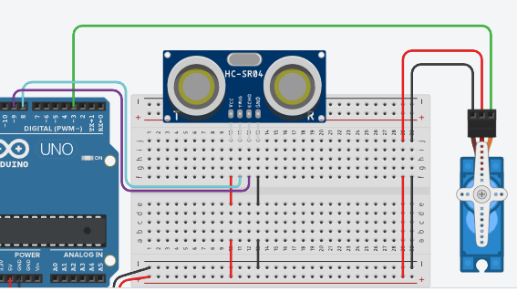

# Atividade 13: Porta Automática com Sensor Ultrassônico e Servomotor

## Descrição
* **Conteúdo:** Leitura de sensor ultrassônico, comparação por distância e acionamento de servomotor.
* **Objetivo:** Detectar a aproximação de um objeto ou pessoa usando o sensor HC-SR04, acionando automaticamente um servomotor que simula a abertura de uma porta.

## Atividade Computacional — Etapas
1. Acesse a plataforma Tinkercad e crie um novo circuito.
2. Reproduza o esquema de ligação da imagem descrita:
   * Sensor ultrassônico HC-SR04 com Trigger no pino D8 e Echo no pino D9.
   * Servomotor com fio de sinal conectado ao pino digital D3.
3. Após revisar as conexões, programe o Arduino conforme as questões A, B e C.



---

## Questão A — Leitura da distância

* **Código Fonte:** [m3_atividade13_questaoA.ino](../../codigos/modulo3/m3_atividade13_questaoA.ino)

```cpp
#define TRIG 8
#define ECHO 9

void setup() {
  Serial.begin(9600);
  pinMode(TRIG, OUTPUT);
  pinMode(ECHO, INPUT);
}

long medirDistancia() {
  digitalWrite(TRIG, LOW);
  delayMicroseconds(2);
  digitalWrite(TRIG, HIGH);
  delayMicroseconds(10);
  digitalWrite(TRIG, LOW);

  long duracao = pulseIn(ECHO, HIGH);
  long distancia = duracao / 58;
  return distancia;
}

void loop() {
  long d = medirDistancia();
  Serial.println(d);
  delay(300);
}
```

### Prever
Com esse código implementado, o sensor de distância consegue influenciar o comportamento do servomotor?
- [ ] Sim
- [ ] Não

### Observar e explicar
Após executar a simulação, observe os valores apresentados no monitor serial e determine os limites percebidos pelo sensor de distância. Explique também por que, neste código, o servomotor ainda não é acionado.

---

## Questão B — Porta automática simples

Quando a distância medida for menor que 120 cm, o servomotor deverá abrir a porta.

* **Código Fonte:** [m3_atividade13_questaoB.ino](../../codigos/modulo3/m3_atividade13_questaoB.ino)

```cpp
#include <Servo.h>

#define TRIG 8
#define ECHO 9

Servo porta;

long medirDistancia() {
  digitalWrite(TRIG, LOW);
  delayMicroseconds(2);
  digitalWrite(TRIG, HIGH);
  delayMicroseconds(10);
  digitalWrite(TRIG, LOW);

  long duracao = pulseIn(ECHO, HIGH);
  return duracao / 58;
}

void setup() {
  porta.attach(3);
  porta.write(0);
  pinMode(TRIG, OUTPUT);
  pinMode(ECHO, INPUT);
}

void loop() {
  long d = medirDistancia();

  if (d < 120)
    porta.write(90);
  else
    porta.write(0);
}
```

### Prever
O servomotor se move com base na distância capturada pelo sensor ultrassônico?
- [ ] Sim
- [ ] Não

### Observar e explicar
Após executar a simulação, observe e explique qual intervalo de distância determina o estado da porta, indicando quando ela permanece aberta ou fechada pelo servomotor.

---

## Questão C — Três níveis de ação do servomotor

Nesta etapa, o comportamento da porta será dividido em três faixas de distância:
* Menor que 50 cm: totalmente aberta (90°);
* Entre 50 cm e 150 cm: meio aberta (45°);
* Maior que 150 cm: fechada (0°).

* **Código Fonte:** [m3_atividade13_questaoC.ino](../../codigos/modulo3/m3_atividade13_questaoC.ino)

```cpp
#include <Servo.h>

#define TRIG 8
#define ECHO 9

Servo porta;

long medirDistancia() {
  digitalWrite(TRIG, LOW);
  delayMicroseconds(2);
  digitalWrite(TRIG, HIGH);
  delayMicroseconds(10);
  digitalWrite(TRIG, LOW);

  long duracao = pulseIn(ECHO, HIGH);
  return duracao / 58;
}

void setup() {
  porta.attach(3);
  porta.write(0);
  pinMode(TRIG, OUTPUT);
  pinMode(ECHO, INPUT);
}

void loop() {
  long d = medirDistancia();

  if (d < 50) {
    porta.write(90);
  }
  else if (d <= 150) {
    porta.write(45);
  }
  else {
    porta.write(0);
  }
  delay(100);
}
```

### Prever
Com esse código implementado, o servomotor passa a atuar por etapas?
- [ ] Sim
- [ ] Não

### Observar e explicar
Após executar a simulação, observe e explique o novo comportamento da porta. Determine também quais são as etapas de atuação do servomotor e como cada faixa de distância influencia sua posição.
